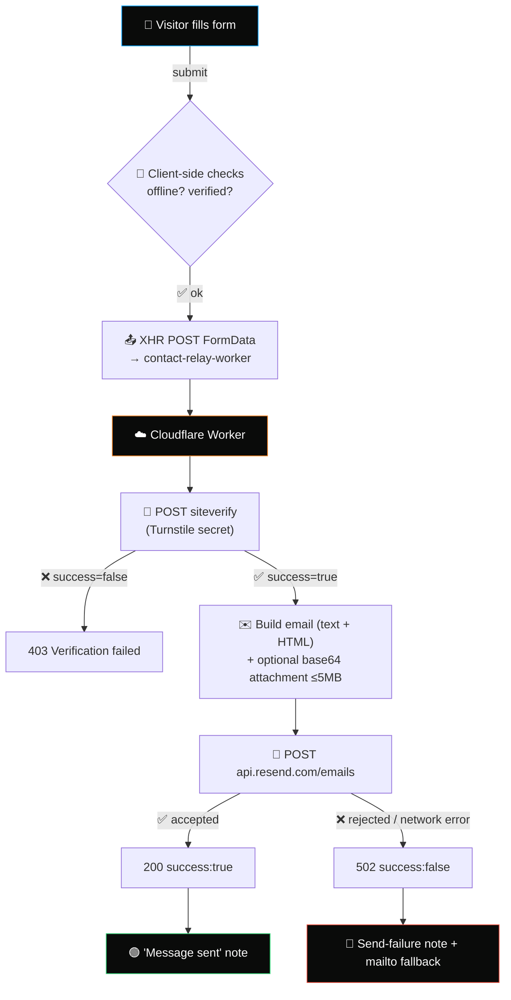

<div align="center">


### The personal portfolio & digital HQ of **TalebiDev** — DevOps Engineer

</div>

<br>

---

## 🙋 About

**TalebiDev** is the personal site of **Mohammad Talebi**, a DevOps Engineer who builds infrastructure by day and refuses to let a portfolio site touch a framework by night. `talebi.dev` is the result: a single-page site that loads instantly, works offline, and ships as plain HTML/CSS/JS you can read top to bottom without a build step in sight.

This repo is the **exact source** behind the live site — hero, timeline, projects, blog, certificates, and a genuinely over-engineered contact form (see [below](#-contact-form-architecture) 👇) — kept public as a reference for how far "no framework" can be pushed without giving up polish.

<div align="center">

[](https://github.com/TalebiDev)
[](https://www.linkedin.com/in/TalebiDev)
[](https://talebi.dev)

</div>

---

## 🧭 Quick Nav

<div align="center">

<a href="#-about"></a>
<a href="#-overview"></a>
<a href="#️-tech-stack"></a>
<a href="#️-project-structure"></a>
<br>
<a href="#-features"></a>
<a href="#-contact-form-architecture"></a>
<a href="#-request-flow"></a>
<a href="#-client-side-state-machine"></a>
<br>
<a href="#️-cloudflare-worker-relay"></a>
<a href="#️-message--warning--error-catalogue"></a>
<a href="#-local-development"></a>
<a href="#-deployment"></a>
<br>
<a href="#-pwa--offline-support"></a>
<a href="#-internationalization"></a>
<a href="#-browser-support"></a>
<a href="#-contributing"></a>

</div>

---

## 🔭 Overview

> A single-page portfolio built the old-school way — **hand-written HTML, CSS & JS**, no bundler, no framework, no dependency tree to babysit. What you see in the source is exactly what ships to the browser.

This repo contains the **entire** production site:

```
🎯 Hero + animated role text     📚 Blog grid w/ pagination
👤 About                          🎓 Courses & certificates (lightbox)
🧗 Experience timeline            🧰 Services
🎓 Education & skills             💬 Testimonial carousel
🚀 Project showcase               ❓ FAQ accordion
🧩 Tech "toolbelt"                 ✉️ Contact form (the fun part 👇)
```

The **only** dynamic backend logic — actually delivering a contact-form message — is handled by a tiny **Cloudflare Worker** that verifies a **Turnstile** challenge and relays through **Resend**. Everything else is 100% static and can be dropped on any CDN.

<div align="center">

| 🏎️ Fast | 🧱 Dependency-free | 🌓 Light/Dark | 🌍 EN/NL | 📴 Offline-ready |
|:---:|:---:|:---:|:---:|:---:|

</div>

---

## 🛠️ Tech Stack

<div align="center">


</div>

| Layer | 🔧 Technology | 📝 Notes |
|---|---|---|
| 🧱 Markup | Semantic HTML5 (`index.html`) | Single page, no templating engine |
| 🎨 Styling | Hand-written CSS3 | CSS custom properties for full theming, no preprocessor |
| ⚙️ Behavior | Vanilla ES6+ JS | Zero runtime dependencies |
| 🔤 Fonts | Sora · Inter · JetBrains Mono · Vazirmatn · ABeeZee | Self-hosted + Google Fonts |
| 🤖 Bot protection | Cloudflare Turnstile | Human verification without CAPTCHAs |
| 📮 Mail relay | Cloudflare Workers + Resend API | Serverless, secrets never touch the client |
| 📴 Offline support | Custom `sw.js` | Cache-first precache, network-first runtime |
| 🌐 Hosting | GitHub Pages (`CNAME`) | Custom domain: `talebi.dev` |
| 📲 PWA | `manifest.json` | Standalone display, maskable + monochrome icons |

---

## 🗂️ Project Structure

```text
talebidev/
├── 📄 index.html                    → the entire single-page site
├── 🚫 404.html                      → custom not-found page (with a live particle warp effect ✨)
├── 📱 manifest.json                 → PWA manifest
├── 📴 sw.js                         → service worker (offline cache)
├── 🗺️ sitemap.xml / robots.txt      → SEO
├── 🌐 CNAME                         → custom domain for GitHub Pages
├── ✅ google41d48fdb57971d4e.html   → Search Console verification
│
├── 🎨 css/
│   ├── style.css                   → readable source stylesheet
│   └── style.min.css               → ⚡ production build (actually loaded)
│
├── ⚙️ js/
│   ├── script.js                   → readable source script
│   └── script.min.js               → ⚡ production build (actually loaded)
│
├── 🔤 fonts/                        → self-hosted variable font files
├── 🖼️ images/                       → icons, favicons, certificates, media
│
└── ☁️ worker/
    └── contact-relay-worker.js     → Turnstile verify + Resend email relay
```

> ⚠️ **Heads up:** `index.html` loads `js/script.min.js` and `css/style.min.css` — **not** the readable sources. Any edit to `script.js` / `style.css` must be mirrored into the `.min.*` files (and the `?v=` cache-busting query bumped), or your change silently never reaches production.

---

## ✨ Features

<table>
<tr>
<td width="50%" valign="top">

### 🖥️ Site-wide

- 📱 Fully responsive single-page portfolio
- 🌓 Light / dark theme, persisted via `localStorage`
- 🌍 English / Dutch language switcher
- ⌨️ Terminal-style typing animation for role text
- 🖼️ Certificate lightbox viewer
- 🎠 Testimonial carousel
- 📖 Blog grid with pagination
- ❓ Animated FAQ accordion

</td>
<td width="50%" valign="top">

### 📬 Contact form

- ✅ Client-side validation + live character counter
- 📎 File attach with drag-and-drop + progress bar
- 💾 Draft autosave (survives refresh / dropped connection)
- 🤖 Turnstile bot verification with **auto-recovery**
- 🔔 Rich animated notification system (13+ distinct states)
- 📡 Live online/offline awareness
- 📧 Always-available `mailto:` fallback

</td>
</tr>
</table>

### 📴 PWA & SEO

- ✅ Installable — real caching service worker, not a checklist no-op
- ✅ `manifest.json` with maskable + monochrome adaptive icons
- ✅ `sitemap.xml`, `robots.txt`, Search Console verification, semantic markup

---

## 📬 Contact Form Architecture

The contact form is the most stateful part of this codebase — so it gets its own deep dive. 🕵️

### 🔀 Request Flow



### 🧠 Client-side State Machine

All logic lives in `js/script.js` (mirrored in `js/script.min.js`), inside the contact-form block.

| Flag / Function | 🎯 Role |
|---|---|
| `turnstileVerified` | `true` once Turnstile's `callback` fires. Reset on expiry, send success/failure, or error. |
| `turnstileInteractivePending` | `true` **only** while the interactive checkbox is genuinely rendering — prevents the wrong message flashing while Cloudflare is still loading. |
| `attemptTurnstileRecovery()` | ⏱️ Periodic timer that detects a missing/errored widget and silently re-renders it. |
| `checkTurnstileStuck()` | 🕐 Stuck-detector (60s) — shows a countdown note and auto-reloads if verification never completes. |
| `saveDraftForRetry()` / `clearDraft()` | 💾 Keeps typed message + file metadata in `localStorage` so nothing is ever lost. |
| Send pipeline | 📡 A single `XMLHttpRequest` (not `fetch`) — needed for upload-progress events and cancel support. |

### ☁️ Cloudflare Worker Relay

`worker/contact-relay-worker.js` — minimal, dependency-free:

1. 🚦 Rejects anything but `POST` / `OPTIONS`; CORS locked to `ALLOWED_ORIGIN`.
2. 🔐 Verifies `cf-turnstile-response` server-side against Cloudflare's `siteverify` endpoint — **the client widget is never trusted alone.**
3. ✉️ Builds a plain-text + HTML-escaped email from `name`, `email`, `phone`, `subject`, `message`, plus an optional attachment (rejected above 5MB).
4. 📮 Relays through the **Resend** API and responds with one clean JSON contract:

```json
{ "success": true }
{ "success": false, "error": "…" }
```

<div align="center">

| 🔑 Required Worker Secret | 🎯 Purpose |
|:---|:---|
| `TURNSTILE_SECRET_KEY` | Server-side Turnstile verification |
| `RESEND_API_KEY` | Authenticates outbound email via Resend |

</div>

> Set via `wrangler secret put` or the Cloudflare dashboard — **never committed to the repo.** 🙅‍♂️

### 🗒️ Message / Warning / Error Catalogue

Everything routes through a single element (`#formNote`), restyled per state, plus a floating toast (`#cfToast`) for two Cloudflare-specific cases.

| Icon | State | Trigger |
|:---:|---|---|
| ⏳ | Sending | Form submitted, request in flight |
| ✅ | Message sent | `200 { success: true }` |
| 📴 | No internet connection | `navigator.onLine === false` at submit |
| 🟡 | Please wait for verification… | Submitted before Turnstile is interactive |
| 🟡 | Please tick the checkbox… | Checkbox on screen and unticked |
| ⏱️ | Verification taking a moment | No completion ~60s after widget appears |
| ⛔ | File format not supported | Extension not in the allow-list |
| ⛔ | File too large | Exceeds max size |
| 🔴 | Couldn't reach the server | XHR network error |
| 🔴 | Sending is taking too long | Client-side timeout |
| 🔴 | Generic send failure | Worker responded `success:false` |
| 🟨 | Draft restored | Saved draft reloaded after a dropped connection |
| 🔔 | Cloudflare check failed / passed | Floating toast |

---

## 💻 Local Development

No build step. No `npm install` required to just look at the site. 🎉

```bash
git clone https://github.com/<your-username>/talebidev.git
cd talebidev

# any static file server works, e.g.:
python3 -m http.server 8080
# or
npx serve .
```

Then open **`http://localhost:8080`** 🚀

> ✍️ **Editing JS/CSS:** edit the readable sources (`js/script.js` / `css/style.css`), then hand-mirror the change into the `.min.*` files that `index.html` actually loads — and bump the `?v=` query string so browsers don't serve a stale cache.

> 🤖 **Contact form locally:** requires a valid Turnstile site key for your local origin (Cloudflare provides [test keys](https://developers.cloudflare.com/turnstile/troubleshooting/testing/) for `localhost`). Without a deployed Worker + real keys, submissions fail verification/delivery **by design**.

---

## 🚀 Deployment

### 🌐 Static site — GitHub Pages

1. 📤 Push to the default branch.
2. ⚙️ In repo settings → **Pages** → set source to this branch/folder.
3. 🌍 GitHub Pages reads `CNAME` and serves the custom domain automatically ([docs](https://docs.github.com/en/pages/configuring-a-custom-domain-for-your-github-pages-site)).

> Any static host works equally well — Cloudflare Pages, Netlify, Vercel, S3 + CDN. No server-side rendering required. 🎯

### ☁️ Cloudflare Worker

```bash
wrangler deploy worker/contact-relay-worker.js --name contact-relay-worker
wrangler secret put TURNSTILE_SECRET_KEY
wrangler secret put RESEND_API_KEY
```

Update `ALLOWED_ORIGIN`, `TO_ADDRESS`, and `FROM_ADDRESS` at the top of the Worker file before deploying, then point the frontend's fetch URL at your deployed route.

### 🔐 Cloudflare Turnstile setup

1. 🆕 Create a Turnstile widget in the Cloudflare dashboard.
2. 🔑 Put the **site key** in `data-sitekey` on `#turnstileWidget` in `index.html`.
3. 🔒 Put the **secret key** only in the Worker's `TURNSTILE_SECRET_KEY` — never client-side.

---

## 📱 PWA & Offline Support

`sw.js` is a **real** caching service worker — not a placeholder registered just to pass a checklist:

- 📦 **Install:** precaches the shell (`/`, `/index.html`, minified CSS/JS, core icons)
- 🌐 **Fetch:** network-first, falling back to cache when offline
- 🎨 `manifest.json` declares standalone display mode with maskable + monochrome adaptive icons

---

## 🌍 Internationalization

🇺🇸 English and 🇳🇱 Dutch copy, toggled client-side via the header language menu and persisted in `localStorage` (`site_lang`). Elements marked `notranslate` (logo, language menu) are excluded from auto-translate tooling.

---

## 🧪 Browser Support

Built on modern, broadly-supported web platform APIs — CSS custom properties, `fetch`/`XMLHttpRequest`, Service Workers.

| ✅ Chrome | ✅ Firefox | ✅ Safari | ✅ Edge |
|:---:|:---:|:---:|:---:|
| Latest | Latest | Latest | Latest |

Graceful degradation is provided for offline/PWA features on browsers without service worker support.

---

## 🤝 Contributing

This is a personal portfolio, not a general-purpose template — but bug reports are always welcome! 🐛

Found a broken layout, a wrong contact-form state, or anything else off? Open an **issue** or a **pull request** describing the problem and your proposed fix.

---

## 📄 License

**All rights reserved.** Source code is publicly viewable for transparency and reference, but the site's content, branding, and design are **not** licensed for reuse without permission.

Want to reuse a specific piece (like the Turnstile/contact-form pattern)? Open an issue first. 🙌

---

<div align="center">

**Made with ☕, 🧠, and probably one too many `console.log()`s by [TalebiDev](https://talebi.dev)**

⭐ If this repo helped you, consider giving it a star!

</div>
